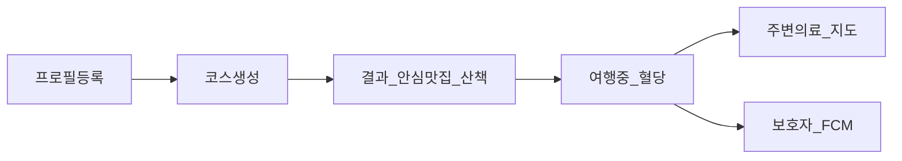

# 기능설명서 복붙용 초안

팀명 **나의성** · 서비스명 **여행 속 주치의(Travel Care AI)** · 부문 **웹·앱 구현** · 지정과제 **5번**

사용법: 공식 PPT 양식의 가이드 문구를 삭제한 뒤, 아래 해당 슬라이드 문구를 그대로/소폭 수정해 붙여넣기.  
공개 URL: https://travel-care-ai.vercel.app · GitHub: https://github.com/shinynanasand-sketch/travel-care-ai

---

## 표지

| 항목 | 내용 |
|------|------|
| 팀 명 | 나의성 |
| 서비스 명 | 여행 속 주치의(Travel Care AI) |

---

## 슬라이드 1 — 서비스 기본 정보

### 서비스명

여행 속 주치의(Travel Care AI)

### 서비스 유형

웹 서비스

### 서비스 타깃

당뇨·고혈압 등 기저질환으로 로컬 외식과 여행이 불안한 만성질환자, 식이 제약이 있는 비건·채식 여행객, 그리고 여행 중 건강 이상 시 알림을 받는 보호자

### 서비스 개요

한국관광공사 TourAPI 기반 안심 식당·명소와 Gemini 메뉴 분석을 결합하고, 식후 산책 코스·혈당 케어까지 이어 주는 만성질환자·비건 맞춤 여행 코스 서비스

### 선택 지정과제

과제번호 5번

### 지정과제 선택 이유

만성질환자는 여행지에서 메뉴·염분·당분 정보를 신뢰하기 어려워 외식을 피하거나 만족도가 떨어지기 쉽습니다. 맞춤형 식당 정보와 식후 활동(산책)을 함께 제공하는 서비스가 부족하다고 판단해, 과제 5번(맞춤형 식당 정보 부족으로 인한 만성질환자의 외식 불안감 및 여행 만족도 저하)을 선택했습니다.

---

## 슬라이드 2 — 기획 방향 · 해시태그

### 지정과제 기반 서비스 기획 방향

1. **안심 맛집 선별:** 건강·식이 프로필(당뇨, 고혈압, 비건 등)을 기준으로 TourAPI 음식점 정보와 메뉴 AI 분석을 결합해 외식 불안을 줄입니다.
2. **식후 산책 코스 결합:** 식사 전후 동선에 산책·힐링에 적합한 관광지·웰니스 스팟을 배치해, 단순 식당 추천을 넘어 여행 만족도를 높입니다.
3. **여행 중 케어 루프:** 혈당 입력·저혈당 시 코스 재조정·주변 의료시설·보호자 FCM 알림으로 돌발 상황에 대응합니다.
4. **데이터 원칙:** 관광 정보는 한국관광공사 OpenAPI를 경유하고, AI 결과는 참고용임을 명시하며 의료 진단·처방은 제공하지 않습니다.

### 해시태그 목록

`#기저질환케어` `#안심맛집` `#비건식당검색` `#식후산책코스`

---

## 슬라이드 3 — 해시태그 연계 핵심기능 및 상세내용

필요 시 PPT에서 본 슬라이드를 복사(Ctrl+D)해 해시태그별로 나눠 써도 됩니다.

### #기저질환케어

| 항목 | 내용 |
|------|------|
| 연계 기능 | · 질환·식이 프로필 등록 · 메뉴 건강 분석(참고용) · 혈당 모니터링 및 저혈당 경고 · 보호자 FCM 알림 · 주변 병원·약국 안내 |
| 상세 내용 | 당뇨·고혈압 등 조건을 프로필에 저장한 뒤, TourAPI 식당 메뉴를 Gemini로 분석해 참고용 건강 신호를 제공합니다. 여행 중 혈당을 기록하고 70 미만이면 코스 재조정과 보호자 푸시 알림을 시도하며, 심평원·카카오 기반 주변 의료시설을 지도로 안내합니다. |

### #안심맛집

| 항목 | 내용 |
|------|------|
| 연계 기능 | · 지역·반경 기반 음식점 검색 · 대표·취급 메뉴(detailIntro) 조회 · 건강·비건 신호등 표시 · 대안 식당 제안 |
| 상세 내용 | KorService2의 지역·위치 기반 목록과 `detailIntro2` 메뉴 정보를 활용해 안심 식당 후보를 구성합니다. AI 분석 결과와 4단계 신호등으로 외식 선택 부담을 줄이고, 결과 화면에서 대안 장소를 제안합니다. |

### #비건식당검색

| 항목 | 내용 |
|------|------|
| 연계 기능 | · ‘비건’·‘채식’ 키워드 검색 우선 배치 · 스코어링·블랙리스트 사전 필터 · 메뉴 AI 비건 판별 · 후보 부재 시 실 TourAPI 풀 Fallback |
| 상세 내용 | `searchKeyword2`로 비건·채식 식당을 우선 확보한 뒤, 광역 스코어링과 블랙리스트 필터, `detailIntro2`+Gemini 분석을 거쳐 FULL_VEGAN / PARTIAL_VEGAN / CHECK_NEEDED / NOT_VEGAN 등급을 표시합니다. API 결과가 비어도 가짜 데이터로 채우지 않고 실제 TourAPI 명소·식당 풀로 우회합니다. |

### #식후산책코스

| 항목 | 내용 |
|------|------|
| 연계 기능 | · 하루 오전·오후 명소 + 식사 클러스터 일정 · 취향(힐링 등) 반영 명소 선정 · 웰니스·무장애 정보 보강 · 하루 재생성·장소 교체 |
| 상세 내용 | 안심 식사 전후에 산책·이동이 쉬운 관광지를 묶어 일정을 생성합니다. `areaBasedList2`·`locationBasedList2` 명소에 Wellness API(조건부)·무장애(`detailWithTour2`) 정보를 보강하고, 여행 취향에 맞게 Gemini가 명소를 고릅니다. 결과에서 하루 단위 재생성과 장소 교체가 가능합니다. |

---

## 슬라이드 4 — 기능 흐름도 · 화면 설명

### 기능 흐름도 (PPT용 참고 — 이미지로 그려 첨부)

텍스트형 흐름:

`건강·식이 프로필 등록 → 지역·기간·취향 선택 후 코스 생성 → 안심 맛집·식후 산책 일정 확인 → 여행 중 혈당 기록·코스 조정 → 주변 의료시설 / 보호자 알림`

### 해시태그·연계기능·기능설명 (화면 캡처와 함께 작성)

아래 블록을 화면 수만큼 슬라이드 복사해 사용합니다.

---

**해시태그1:** `#기저질환케어`  
**연계기능1:** 질환 프로필 기반 건강 케어 및 혈당 모니터링 기능  
**기능설명1:** 사용자가 당뇨·고혈압 등 조건을 등록하고, 여행 중 혈당을 입력하면 위험 구간에 경고·코스 재조정·보호자 알림을 제공합니다.  
**화면 캡션 예시:** 프로필 화면에서 질환을 선택한 뒤 저장한다. / 여행중 화면에서 혈당을 입력한다.

---

**해시태그2:** `#안심맛집`  
**연계기능2:** TourAPI·AI 기반 안심 식당 추천 기능  
**기능설명2:** 관광공사 음식점·메뉴 정보를 바탕으로 건강·식이 조건에 맞는 식당을 추천하고 신호등으로 안심도를 표시합니다.  
**화면 캡션 예시:** 코스 결과 화면에서 식당 카드와 신호등을 확인한다.

---

**해시태그3:** `#비건식당검색`  
**연계기능3:** 비건·채식 키워드 검색 및 메뉴 검증 기능  
**기능설명3:** ‘비건’·‘채식’ 키워드 검색과 메뉴 AI 분석으로 비건 적합도를 4단계로 안내합니다.  
**화면 캡션 예시:** 비건 프로필로 생성한 코스에서 비건 신호등을 확인한다.

---

**해시태그4:** `#식후산책코스`  
**연계기능4:** 식사와 연계한 산책·힐링 명소 일정 생성 기능  
**기능설명4:** 안심 식사 전후에 산책하기 좋은 관광지·웰니스 스팟을 묶어 하루 코스를 구성하고, 필요 시 장소를 교체합니다.  
**화면 캡션 예시:** 코스 결과에서 오전·오후 명소와 식사 일정을 확인한다. / 「이런 곳은 어떠세요?」로 대안 장소를 본다.

> 화면 캡처·부연 설명: [FUNCTIONAL_DESCRIPTION_IMAGES.md](./FUNCTIONAL_DESCRIPTION_IMAGES.md) · 이미지 [screenshots/](./screenshots/)

---

## 슬라이드 5 — 서비스 대표·상세 이미지

### 서비스 대표 이미지 (썸네일) — 1장

| 권장 화면 | URL | 촬영 포인트 |
|-----------|-----|-------------|
| 홈 히어로 | `/` | 「여행 속 주치의」 브랜드·한 줄 소개가 보이게 |

### 서비스 상세 이미지 — 3~5장

| # | 권장 화면 | URL | 촬영 포인트 |
|---|-----------|-----|-------------|
| 1 | 프로필 | `/profile` | 당뇨 등 질환·식이 조건 선택 UI |
| 2 | 코스 결과 | `/plan/result` | 썸네일, Day별 명소·식당, 신호등 |
| 3 | 대안·편집 | `/plan/result` | 「이런 곳은 어떠세요?」·장소 교체 |
| 4 | 여행중 혈당 | `/travel` | 혈당 입력·경고 배너 |
| 5 | 주변 의료 | `/travel/nearby` | 지도·병원/약국 카드 |

체크리스트

- [ ] 썸네일 1장 확보
- [ ] 상세 이미지 3~5장 확보 (권장 5장)
- [ ] 의료 진단이 아닌 **참고용** 문구가 보이면 그대로 두거나, 과도한 개발 배너는 숨김 설정 후 촬영
- [ ] `npm run test:demo-preflight` 후 Vercel 실연동 화면으로 촬영 권장

> 화면 캡처·부연 설명: [FUNCTIONAL_DESCRIPTION_IMAGES.md](./FUNCTIONAL_DESCRIPTION_IMAGES.md) · 이미지 [screenshots/](./screenshots/)

---

## 슬라이드 6 — 한국관광공사 OpenAPI 리스트

### 1

**API명:** 한국관광공사 국문 관광정보서비스(KorService2) — areaBasedList2  
**상세설명:** 법정동·지역 코드 기반 관광지·문화시설을 조회해 일정 명소 후보로 활용

### 2

**API명:** 한국관광공사 국문 관광정보서비스(KorService2) — locationBasedList2  
**상세설명:** GPS·반경 기반 음식점·명소 검색. 지역 코드 장애 시 보험용 후보 풀로도 활용

### 3

**API명:** 한국관광공사 국문 관광정보서비스(KorService2) — searchKeyword2  
**상세설명:** ‘비건’·‘채식’ 키워드로 안심·비건 식당 후보를 우선 검색

### 4

**API명:** 한국관광공사 국문 관광정보서비스(KorService2) — detailIntro2  
**상세설명:** 음식점 대표·취급 메뉴 정보를 조회해 Gemini 건강·비건 분석 입력으로 사용

### 5

**API명:** 한국관광공사 관광정보 서비스 무장애여행(KorWithService2) — detailWithTour2  
**상세설명:** 휠체어·엘리베이터 등 무장애 정보를 조회해 일정 안전·접근성 보강

### 6 (양식 칸이 5개면 1~5만 넣고, 가능하면 추가 슬라이드에 기재)

**API명:** 한국관광공사 웰니스 관광(WellnessTursmService) — locationBasedList  
**상세설명:** 힐링 취향·지역 데이터 존재 시 웰니스 스팟을 식후 산책·휴식 코스에 조건부 배정. 데이터 부재 시 일반 명소로 대체

---

## 슬라이드 7 — 기타 API · 파일데이터

해당 슬라이드 유지(활용 있음).

### 1

**데이터명:** Google Gemini API  
**상세설명:** 식당 메뉴 건강·비건 분석 및 여행 취향 반영 명소 선정. 결과는 참고용이며 의료 진단·처방이 아님

### 2

**데이터명:** 카카오맵 JavaScript API / 카카오 Local API  
**상세설명:** 코스·주변 시설 지도 표시 및 의료시설 검색 폴백

### 3

**데이터명:** 건강보험심사평가원(HIRA) 병원·약국 API, 응급의료기관 정보  
**상세설명:** 여행 동선 주변 병원·약국·응급실 안내로 만성질환자 안전망 구성

### 4 (칸이 더 있으면)

**데이터명:** Firebase Cloud Messaging(FCM)  
**상세설명:** 혈당 70 미만 등 위험 상황에서 보호자에게 푸시 알림 전송

### 5 (칸이 더 있으면)

**데이터명:** Upstash Redis  
**상세설명:** TourAPI 호출 전 캐시 확인으로 응답 속도·호출량 최적화

---

## 슬라이드 8 — 차별성 · 발전계획

### 차별성

- 지정과제 5번의 핵심인 **안심 맛집 + 식후 산책 코스**를 TourAPI 실데이터로 구현하고, **비건 검증 파이프라인**(키워드·스코어링·메뉴 AI·신호등)으로 식이 제약을 함께 해결합니다.
- 계획 단계에 그치지 않고 **여행 중 혈당 모니터링·코스 재조정·보호자 FCM·주변 의료지도**까지 이어 외식 불안과 돌발 건강 상황 대응을 한 흐름으로 제공합니다.
- 웰니스·무장애 API로 일정의 휴식·접근성을 보강하고, 후보가 없을 때 가짜 데이터 대신 **실제 TourAPI Fallback**을 사용해 공모전 데이터 활용 취지에 맞춥니다.
- AI·건강 정보는 항상 **참고용**임을 고지하며 진단·처방을 하지 않습니다.

### 발전계획

- 보호자 알림(FCM)과 실관광기상 연동을 고도화하고, 보호자용 요약 대시보드를 보강합니다.
- 질환·식이 규칙(알레르기, 할랄 등)과 지역별 안심 식당 데이터 커버리지를 확대합니다.
- TourAPI 품질·누락 피드백을 쌓아 추천 정확도를 개선하고, 접근성(무장애) 정보를 일정 편집 UX에 더 깊게 반영합니다.
- 데모·현장 검증 후 모바일 웹 사용성·다국어(방한 만성질환자) 확장을 검토합니다.

---

## 부록 A — PPT 붙여넣기 체크

- [ ] 표지: 팀명 나의성 / 서비스명 여행 속 주치의(Travel Care AI)
- [ ] 지정과제: **과제번호 5번** (오기재 주의)
- [ ] 가이드 문구·예시 박스 전부 삭제
- [ ] 해시태그 4개 모두 슬라이드 3·4에 연결
- [ ] OpenAPI 5개 이상 + 기타 API 슬라이드 작성
- [ ] 대표 이미지 1 + 상세 3~5 첨부
- [ ] 기능 흐름도 이미지 첨부

## 부록 B — 한 줄 요약 (참가신청란 보조)

Travel Care AI(여행 속 주치의)는 과제 5번을 해결하기 위해 TourAPI 안심 식당·명소와 AI 메뉴 분석, 식후 산책 코스, 여행 중 혈당·보호자 알림을 결합한 웹 서비스입니다.
