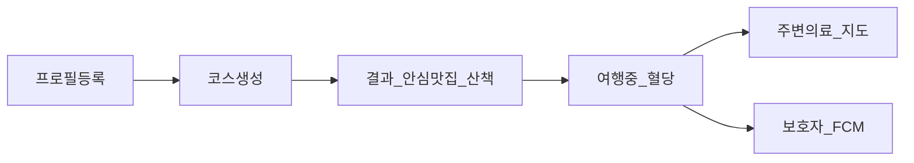
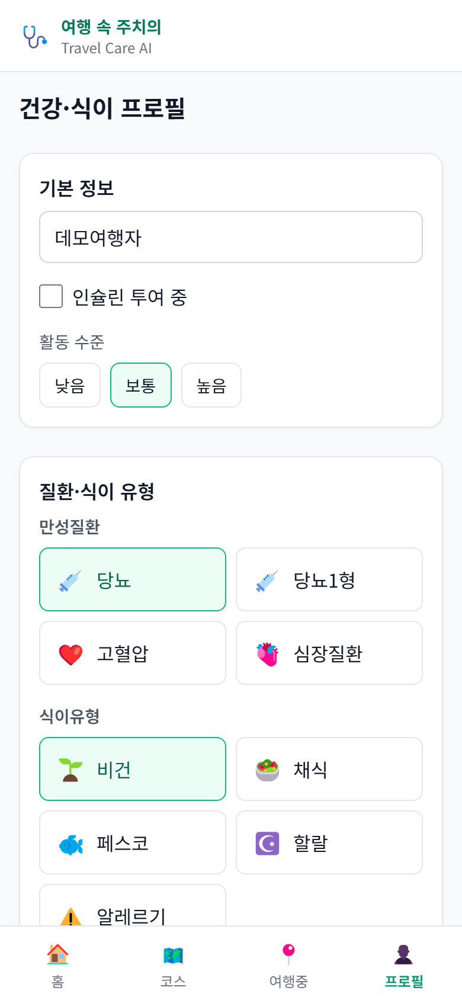
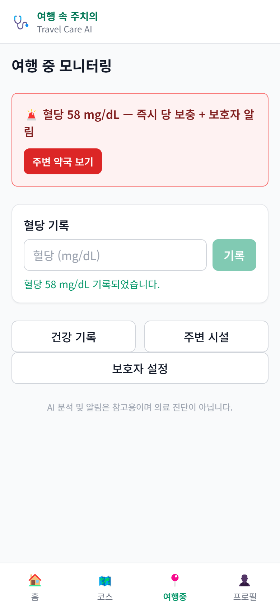
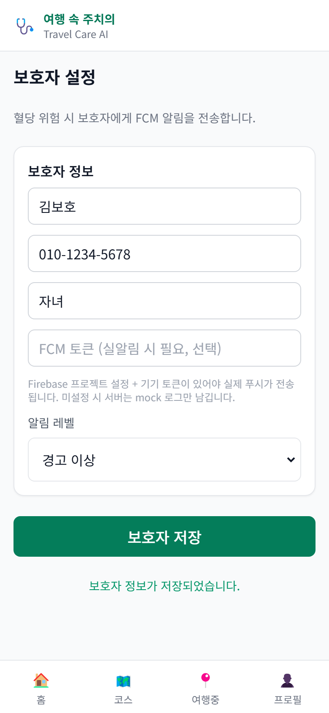
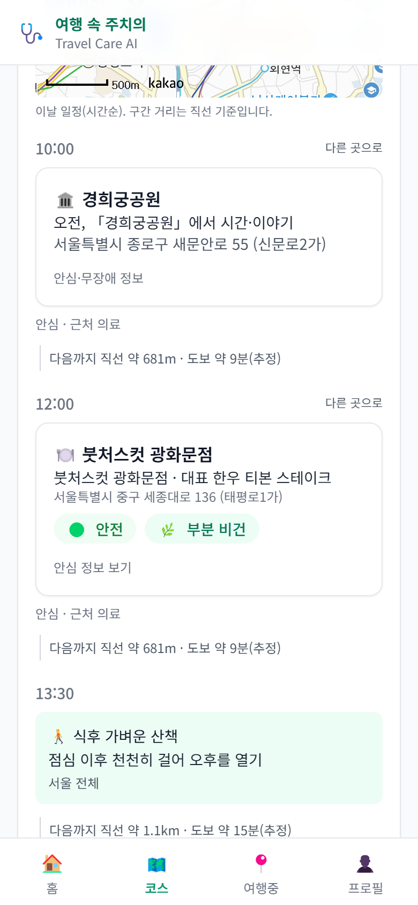
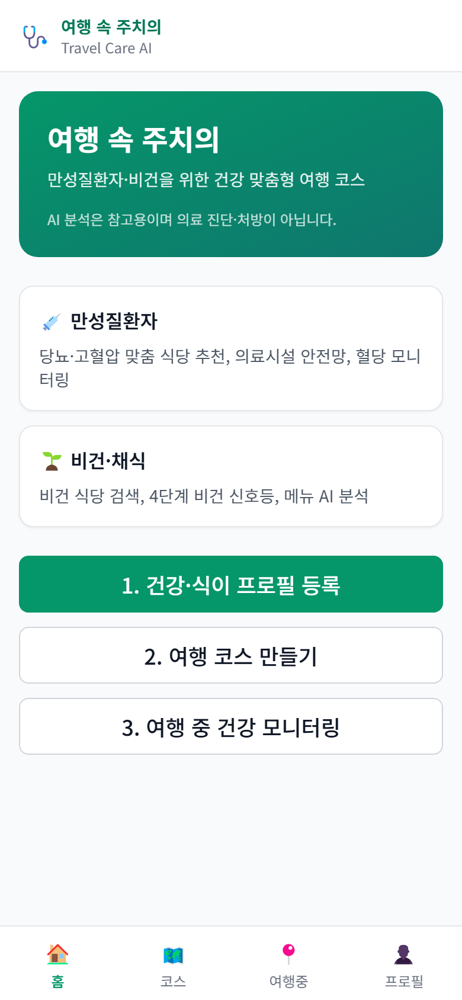
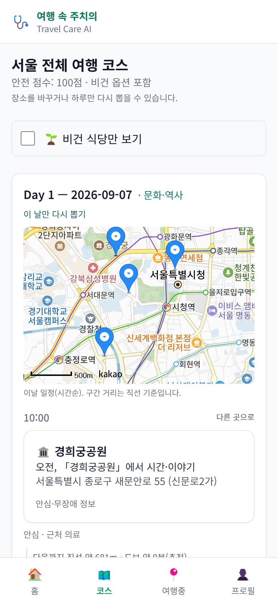
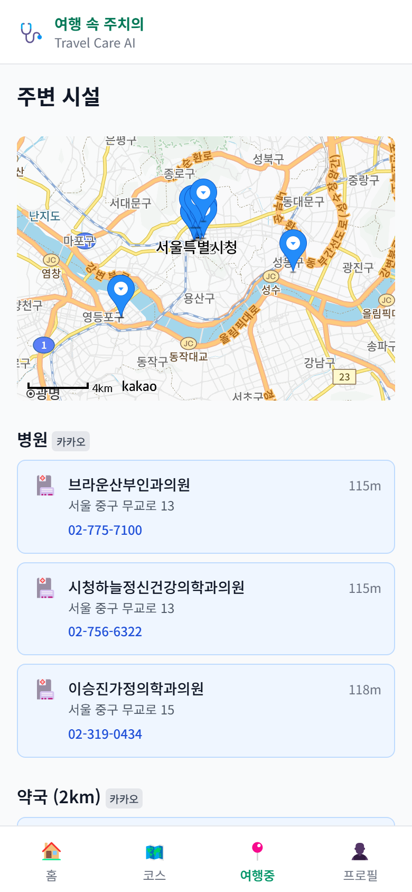

# 기능설명서 슬라이드 4·5 — 화면 캡처 · 부연 설명

촬영 기준: `https://travel-care-ai.vercel.app` · 뷰포트 **390×844** (deviceScaleFactor 2)  
이미지 폴더: [screenshots/](./screenshots/)  
재촬영: `node scripts/capture-submission-screens.mjs` (Playwright Chromium)

> AI·건강 정보는 **참고용**이며 의료 진단·처방이 아닙니다.  
> 촬영 시 `[개발]` 의료 진단 배너는 숨긴 상태로 저장했습니다.

---

## 슬라이드 4 — 기능 흐름도 · 화면 설명

텍스트형 흐름:

`건강·식이 프로필 등록 → 지역·기간 선택 후 코스 생성 → 안심 맛집·식후 산책 일정 확인 → 여행 중 혈당 기록·코스 조정 → 주변 의료시설 / 보호자 알림`

### 해시태그1: `#기저질환케어`

**연계기능1:** 질환 프로필 기반 건강 케어 및 혈당 모니터링 기능  
**기능설명1:** 사용자가 당뇨·고혈압 등 조건을 등록하고, 여행 중 혈당을 입력하면 위험 구간에 경고·주변 약국·병원 안내·보호자 알림을 제공합니다.

| 이미지 | 화면 캡션 | 부연 설명 |
|--------|-----------|-----------|
|  | 프로필 화면에서 질환을 선택한 뒤 저장한다. | `/profile`에서 당뇨·비건 등 질환·식이 칩을 복합 선택할 수 있습니다. 저장 후 코스 생성·메뉴 분석·신호등에 반영되며, AI 결과는 참고용임을 UI에 고지합니다. |
|  | 여행중 화면에서 혈당을 입력한다. | `/travel`에서 혈당 58을 기록하면 `즉시 당 보충 + 보호자 알림` 경고와 「주변 약국 보기」가 표시됩니다(70 미만 DANGER). 하단 참고용 문구를 유지합니다. |
|  | 보호자를 등록해 저혈당 시 FCM 알림을 받을 수 있게 한다. | `/guardian`에서 이름·전화·관계를 저장합니다. 혈당 위험 시 등록 보호자에게 긴급 푸시를 보내는 흐름(기능 흐름도의 보호자 FCM 단계)과 연결됩니다. |

---

### 해시태그2: `#안심맛집`

**연계기능2:** TourAPI·AI 기반 안심 식당 추천 기능  
**기능설명2:** 관광공사 음식점·메뉴 정보를 바탕으로 건강·식이 조건에 맞는 식당을 추천하고 신호등으로 안심도를 표시합니다.

| 이미지 | 화면 캡션 | 부연 설명 |
|--------|-----------|-----------|
|  | 코스 결과 화면에서 식당 카드와 신호등을 확인한다. | `/plan/result`의 식사 슬롯에 TourAPI 식당·메뉴 기반 **건강 신호등**(안전/주의/위험)이 붙습니다. 카드에서 안심 정보·근처 의료 거리를 함께 확인할 수 있습니다. |

---

### 해시태그3: `#비건식당검색`

**연계기능3:** 비건·채식 키워드 검색 및 메뉴 검증 기능  
**기능설명3:** ‘비건’·‘채식’ 키워드 검색과 메뉴 AI 분석으로 비건 적합도를 4단계로 안내합니다.

| 이미지 | 화면 캡션 | 부연 설명 |
|--------|-----------|-----------|
|  | 비건 프로필로 생성한 코스에서 비건 신호등을 확인한다. | 비건 조건 코스에서 식당 카드에 **완전 비건 / 부분 비건 / 확인 필요 / 비건 불가** 등급이 표시됩니다. 상단 「비건 식당만 보기」 필터로 식이 제약을 빠르게 좁힐 수 있습니다. |

---

### 해시태그4: `#식후산책코스`

**연계기능4:** 식사와 연계한 산책·힐링 명소 일정 생성 기능  
**기능설명4:** 안심 식사 전후에 산책하기 좋은 관광지·웰니스 스팟을 묶어 하루 코스를 구성하고, 필요 시 장소를 교체합니다.

| 이미지 | 화면 캡션 | 부연 설명 |
|--------|-----------|-----------|
|  | 코스 결과에서 오전·오후 명소와 식사 일정을 확인한다. | Day별 테마·지도 핀·시간순 일정(명소 → 식사 → 식후 산책 등)이 한 화면에 이어집니다. 「이 날만 다시 뽑기」로 하루 단위 재생성이 가능합니다. |
|  | 「이런 곳은 어떠세요?」로 대안 장소를 본다. / 「다른 곳으로」로 장소를 교체한다. | 촬영 시점 API 응답에 대안 스트립(`이런 곳은 어떠세요?`) 후보가 비어, **장소 교체 UI(「다른 곳으로」)** 를 중심으로 캡처했습니다. PPT에는 장소 편집·재생성 기능을 강조하면 됩니다. |

---

## 슬라이드 5 — 서비스 대표·상세 이미지

### 서비스 대표 이미지 (썸네일) — 1장

| 파일 | URL | 촬영 포인트 | 부연 설명 |
|------|-----|-------------|-----------|
|  | `/` | 「여행 속 주치의」 브랜드·한 줄 소개 | 히어로에 서비스명·타깃(만성질환자·비건)·**참고용(비진단)** 문구가 한눈에 보입니다. PPT 썸네일로 권장합니다. |

### 서비스 상세 이미지 — 5장 (+보호자 1장)

| # | 파일 | URL | 촬영 포인트 | 부연 설명 |
|---|------|-----|-------------|-----------|
| 1 |  | `/profile` | 당뇨 등 질환·식이 조건 선택 UI | 만성질환·식이유형 칩을 복합 선택하는 진입 화면입니다. |
| 2 |  | `/plan/result` | 썸네일, Day별 명소·식당, 안전 점수 | 안전 점수·비건 옵션·Day1 지도·명소 카드가 보이는 결과 상단입니다. |
| 3 |  | `/plan/result` | 「다른 곳으로」·하루 재생성 | 일정 편집(장소 교체·하루 재생성) UX를 보여주는 상세 컷입니다. |
| 4 |  | `/travel` | 혈당 입력·경고 배너 | 저혈당(58) 경고와 약국 안내 CTA가 핵심입니다. |
| 5 |  | `/travel/nearby` | 지도·병원/약국 카드 | 카카오맵과 병원·약국 거리·전화 카드로 여행 중 안전망을 보여 줍니다. |
| 6 (추가) |  | `/guardian` | 보호자 설정·FCM 안내 | 슬라이드 4 흐름도의 보호자 알림 단계를 보강하는 상세 컷입니다. |

---

## 파일 목록

| 파일명 | 용도 |
|--------|------|
| `01-home-hero.png` | 슬라이드 5 대표 썸네일 |
| `02-profile-conditions.png` | 슬라이드 4 #기저질환케어 · 슬라이드 5-1 |
| `03-result-overview.png` | 슬라이드 5-2 |
| `04-result-restaurant-lights.png` | 슬라이드 4 #안심맛집 |
| `05-result-vegan-lights.png` | 슬라이드 4 #비건식당검색 |
| `06-result-day-schedule.png` | 슬라이드 4 #식후산책코스 |
| `07-result-alternatives.png` | 슬라이드 4·5 장소 교체/대안 |
| `08-travel-glucose.png` | 슬라이드 4 #기저질환케어 · 슬라이드 5-4 |
| `09-nearby-medical.png` | 슬라이드 5-5 |
| `10-guardian.png` | 슬라이드 4 보호자 FCM |

---

## 촬영 메모

- 프로필 CTA(배포본): `저장하고 여행 계획하기`
- 코스: 서울 전체 · 3일 · 당뇨+비건 프로필로 실생성
- 대안 스트립(`이런 곳은 어떠세요?`)은 해당 회차 generate 응답에 `alternatives`가 비어 장소 교체 UI로 대체
- Vercel에 `NEXT_PUBLIC_SHOW_MEDICAL_DIAGNOSTICS=true`인 경우 캡처 스크립트가 `[개발]` 배너를 숨김
- 로그: [screenshots/capture-log.txt](./screenshots/capture-log.txt)
